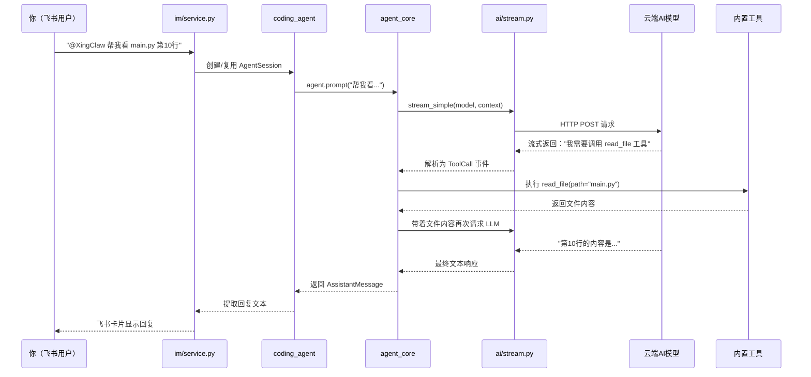

# 总览

**XingClaw 是一个用 Python 写的 AI 编程助手系统。** 你在命令行或飞书里跟它说话，它能帮你读代码、写代码、执行命令、搜索文件。

---

**整体架构**：整个系统分成 4 层

```
┌──────────────────────────────────┐
│  第4层：IM 飞书桥接 (im/)         │  ← 用户通过飞书跟 Agent 对话
├──────────────────────────────────┤
│  第3层：编程 Agent 应用 (coding_agent/) │  ← 工具、会话、CLI
├──────────────────────────────────┤
│  第2层：Agent 编排内核 (agent_core/)    │  ← Agent循环，"大脑"，决定调什么工具
├──────────────────────────────────┤
│  第1层：统一 LLM 接口 (ai/)            │  ← 跟各家 AI 厂商通信
└──────────────────────────────────┘
```

**学习方式**

- **先跑示例**：在看源码之前，先 `python examples/quickstart.py` 跑一遍，有个感性认识
- **从数据结构开始**：先看 `ai/types.py`，理解"消息长什么样"比理解"消息怎么处理"更重要
- **跟着调用链走**：每篇笔记都会给出 Mermaid 时序图，跟着箭头的方向读代码
- **不怕看不懂**：遇到 `async/await` 先跳过，知道"这个函数需要等结果"就行，后面会专门解释
- **善用测试文件**：`tests/` 目录下的测试就是最好的"使用说明书"，看看别人怎么调用这些函数的

---

**一次完整请求的生命周期**：当你在飞书里发一条消息"帮我看一下 main.py 的第 10 行是什么"，系统内部会发生什么？




# 文档总览


### AI 统一接口层`src/ai/`

这是整个系统的"地基"。你会学到：

| 文档 | 学什么 |
|------|--------|
| `01_消息与模型类型体系.md` | 理解系统中"消息"是什么样子的数据结构，就像学快递行业先要认识快递单 |
| `02_Provider注册与分发机制.md` | 理解系统怎么管理多家 AI 厂商，就像外卖平台怎么管理多家餐厅 |
| `03_流式响应与事件流.md` | 理解 AI 的回复为什么是"一个字一个字蹦出来的"，以及怎么处理这种流式数据 |
| `04_Token溢出估算.md` | 理解为什么对话太长会被截断，以及怎么估算"还能说多少话" |

### 第2站：Agent 编排内核`src/agent_core/`

这是系统的"大脑"。你会学到：

| 文档 | 学什么 |
|------|--------|
| `01_Agent对象与生命周期.md` | Agent 从创建到运行到结束的完整过程 |
| `02_主循环详解.md` | Agent 怎么"思考→行动→再思考"的核心循环 |
| `03_工具协议与执行策略.md` | 怎么定义一个"工具"让 AI 调用，串行和并行有什么区别 |
| `04_事件驱动架构.md` | 系统内部怎么用"事件"传递消息，就像广播电台一样 |

### 第3站：编程 Agent 应用层（`src/coding_agent/`）

这是把"大脑"包装成真正可用产品的地方。你会学到：

| 文档 | 学什么 |
|------|--------|
| `01_会话工厂与资源加载.md` | 系统启动时怎么把所有零件组装起来 |
| `02_内置工具实现.md` | read/write/edit/bash/grep 这些工具是怎么实现的 |
| `03_会话持久化与分叉.md` | 聊天记录怎么保存到磁盘，怎么支持"存档+读档" |
| `04_上下文压缩与重试.md` | 对话太长怎么压缩，请求失败怎么自动重试 |
| `05_CLI与运行模式.md` | 命令行界面怎么设计，三种运行模式有什么区别 |

### 第4站：IM 飞书桥接层（`src/im/`）

这是让 Agent 走出命令行、进入真实聊天场景的地方。你会学到：

| 文档 | 学什么 |
|------|--------|
| `01_IM服务核心架构.md` | IMService 怎么把飞书消息转成 Agent 的输入 |
| `02_飞书适配器实现.md` | 飞书 API 怎么收发消息，Webhook 和长连接有什么区别 |
| `03_会话路由与记忆系统.md` | 怎么让每个飞书频道有自己的对话上下文和长期记忆 |


# 文件总览

文件总览

- .env.example：Linux/macOS的环境变量，存储飞书凭证、LLM配置
- .env.ps1.example：Windows PowerShell的环境变量，存储飞书凭证、LLM配置
- dev.ps1：XingClaw Windows 本地调试启动脚本
- dev.sh：Linux/macOS 本地调试启动脚本
- pyproject.toml：项目配置文件，记录项目名称、版本、描述、Python 版本要求、项目依赖、开发依赖等
- uv.lock：锁定文件记录**精确安装版本**
- pyproject.toml 和 uv.lock 都是 Python 项目依赖管理相关的文件。
  - 为什么需要两个文件记录依赖的版本，这样功能不重复吗
    - pyproject.toml：项目需要哪些依赖，允许什么版本范围
    - uv.lock：实际安装的完整依赖树和精确版本

生成pyproject.toml：执行后会创建一个 Python 项目，并生成 pyproject.toml

```
uv init
```

添加依赖：会同时更新 pyproject.toml 和 uv.lock，不要手动去改 uv.lock

```
uv add 包名
```

uv.lock 一般不是手写的，是 uv 根据 pyproject.toml 自动解析依赖后生成的

```
uv lock
#或
uv sync
```


| 你想做什么 | 看哪个文件 |
|-----------|-----------|
| 了解所有数据结构长什么样 | `src/ai/types.py` |
| 看最简单的 LLM 调用示例 | `examples/quickstart.py` |
| 看 Agent + 工具的示例 | `examples/agent_core_quickstart.py` |
| 理解 Agent 的核心循环 | `src/agent_core/agent_loop.py` |
| 看有哪些内置工具 | `src/coding_agent/builtin_tools.py` |
| 理解系统怎么组装的 | `src/coding_agent/factory.py` |
| 看飞书桥接怎么工作 | `src/im/service.py` |


**文件总览**：这两个都是**本地生成目录**，一般不提交到 Git。

- .venv：Python 虚拟环境目录，存放这个项目单独的 Python 解释器环境和依赖包，避免污染系统 Python。

- .xingclaw：项目的运行状态/工作区资源目录。代码里会从 .xingclaw 读取 settings.json、prompt.md、tools.json 这类配置，也会把编程 Agent 的会话保存到 .xingclaw/sessions/<session_id>/。当前你这个目录里有 im/ 和 sessions/，说明之前跑过 IM/Agent 相关功能，里面有 context.jsonl、events.jsonl、meta.json、session.jsonl 等会话记录。对应代码在 resources.py、session_store.py

  - 运行 IM 服务时先生成了`.xingclaw/im/events`

    ```
    # src/im/cli.py设置默认事件目录
    Path(args.workspace) / ".xingclaw" / "im" / "events"
    
    # src/im/events.py真正创建目录
    # parents=True，所以它会一次性把父目录 .xingclaw/、.xingclaw/im/ 也创建出来
    # pathlib.Path 提供的路径拼接写法，不需要使用join
    self._events_dir.mkdir(parents=True, exist_ok=True)
    ```

  - IM 收到/处理会话时，又创建了 session_map 和 sessions 会话目录

    - .xingclaw/im/session_map.json
    - .xingclaw/sessions/
    - .xingclaw/sessions/im_37db4dd4c9e3/

  - 对应代码是：

    - src/im/session_router.py (line 15)：创建 .xingclaw/im/session_map.json 所在目录。
    - src/coding_agent/session_store.py (line 36)：会话目录路径是 .xingclaw/sessions/<session_id>。
    - src/coding_agent/session_store.py (line 43)：真正 mkdir 创建 session 目录。

文件总览：src、examples、tests

- src/：业务代码

  - src/ai/：统一 AI 接口层，模型定义、流式调用、OpenAI/Anthropic 兼容 provider、上下文 token 估算等。
  - src/agent_core/：Agent 编排内核，负责主循环、工具调用、事件流、Agent 状态管理。
  - src/coding_agent/：编程 Agent 应用层，包含 CLI、会话持久化、内置工具、.xingclaw 资源加载、MCP 桥接、扩展/skills 等。
  - src/im/：IM/飞书桥接层，负责飞书消息接入、事件监听、会话路由、频道记忆、HTTP/长连接服务。
  - src/xingclaw.egg-info/：安装包元信息，一般是 pip install -e . 之类命令生成的。

- examples/：示例代码，演示怎么调用项目里的能力

  - quickstart.py：演示最基础的 AI 调用。
  - agent_core_quickstart.py：演示直接使用 Agent Core 和工具调用。
  - coding_agent_quickstart.py：演示创建 Coding Agent 会话。
  - coding_agent_interactive_mode.py / coding_agent_print_mode.py：演示交互模式和打印模式。
  - coding_agent_resume_quickstart.py：演示恢复已有会话。

- tests/：自动化测试代码，验证 src/ 里的功能是否正常

  - test_agent_core_loop.py：测试 Agent 主循环和工具执行。
  - test_coding_agent_*：测试 Coding Agent 的 CLI、资源加载、会话存储、runner、MCP。
  - test_im_*：测试飞书适配器、IM 服务、事件监听、长连接等。

  


