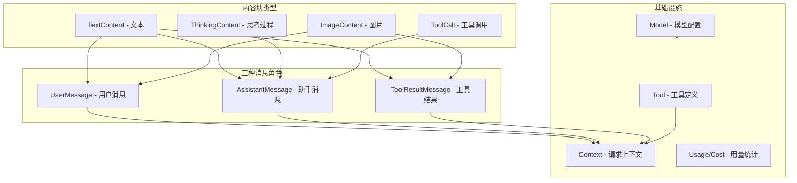

# 消息与模型类型体系

消息与模型类型体系：`src/ai/types.py`

- 角色role：user、assistant、toolResult
- 内容content：文本？图片？还是工具调用指令？
- 模型model：Anthropic Claude、OpenAI GPT

## 概念地图



## 源码

## 其他

```python
# 协议标识：用于把请求分发到对应 provider, openai-compatible/anthropic
Api = str
# 供应商标识：用于鉴权和模型分组。
Provider = str
# 一次回答结束原因：正常结束stop/达到长度限制length/工具调用toolUse/错误error/被外部中断aborted。
StopReason = Literal["stop", "length", "toolUse", "error", "aborted"]
# 简化推理等级（留给 stream_simple 接口使用）。
ThinkingLevel = Literal["minimal", "low", "medium", "high", "xhigh"]


####################################################################
# 成本统计、用量统计
####################################################################

# @dataclass是装饰器(注解)，类似Java的@Data，自动生成一些常用方法
# 如__init__()、__repr__()、__eq__()等。
@dataclass
class Cost:
    """成本统计，单位由上层自行约定（通常是美元）。"""
    input: float = 0.0
    output: float = 0.0
    cache_read: float = 0.0
    cache_write: float = 0.0
    total: float = 0.0


@dataclass
class Usage:
    """token 使用统计。"""
    input: int = 0
    output: int = 0
    cache_read: int = 0
    cache_write: int = 0
    total_tokens: int = 0
    cost: Cost = field(default_factory=Cost)
```


### 4种内容块

一条消息的内容是**一个块列表**

- `@dataclass`：装饰器，装饰器(注解)，类似Java的@Data，自动生成一些常用方法，如 如`__init__()`、`__repr__()`、`_eq__()`等
- `Literal["text"]` ：这个字段的值只能是 `"text"` 这个字符串，不能是别的。这是用来做"类型标签"的。
- `field(default_factory=dict)` ：默认值是空字典。不能直接写 `arguments: dict = {}`，因为那样所有实例会共享同一个字典（Python 经典坑！）。默认值是不可变的，比如 0、""、None，可以直接写；默认值是可变容器，比如 dict、list、set，用 default_factory。

```python
####################################################################
# 4种内容块：文本块、思考块、图片块、工具调用块
####################################################################

@dataclass
class TextContent:
    """普通文本块。"""
    # type 字段只能是字符串 "text"，默认值也是 "text"
    # Literal["text"]表示这个变量的值必须是某个具体的字面量
    type: Literal["text"] = "text"
    # 类型是str，默认值是空字符串
    text: str = ""
    # Optional[str] 等同于 str | None（或 Union[str, None]），表示该字段可以是字符串也可以是 None。
    text_signature: Optional[str] = None


@dataclass
class ThinkingContent:
    """模型的思考块（如果 provider 支持）。"""

    type: Literal["thinking"] = "thinking"
    thinking: str = ""
    thinking_signature: Optional[str] = None
    redacted: bool = False


@dataclass
class ImageContent:
    """图片块，使用 base64 数据承载。"""

    type: Literal["image"] = "image"
    data: str = ""
    mime_type: str = "image/png"


@dataclass
class ToolCall:
    """模型发起的工具调用。"""

    type: Literal["toolCall"] = "toolCall"
    id: str = ""
    name: str = ""
    # 字典key 是 str，value 可以是任意类型；
    # 如果创建对象时不传 arguments，dataclass 会调用 dict() 生成一个新的空字典。
    # 默认值是不可变的，比如 0、""、None，可以直接写；
    # 默认值是可变容器，比如 dict、list、set，用 default_factory。
    arguments: dict[str, Any] = field(default_factory=dict)
```


### 3种消息角色

3种消息角色

- `Union[str, list[UserBlock]]` ：字段只能是字符串、列表；Python 3.10+ 可以写成 `str | list[UserBlock]`。
- `StopReason` ：正常结束stop/达到长度限制length/工具调用toolUse/错误error/被外部中断aborted。
- `ToolResultMessage` 通过 `tool_call_id` 跟 `ToolCall` 配对——AI 说"我要调用工具 A"（ToolCall），工具执行完后返回"工具 A 的结果是 xxx"（ToolResultMessage），两者通过 id 关联。

```python
####################################################################
# 3种消息角色：用户消息、助手消息、工具结果消息
####################################################################

AssistantBlock = Union[TextContent, ThinkingContent, ToolCall]
UserBlock = Union[TextContent, ImageContent]
ToolResultBlock = Union[TextContent, ImageContent]


@dataclass
class UserMessage:
    """用户消息。"""

    role: Literal["user"] = "user"
    content: Union[str, list[UserBlock]] = ""
    timestamp: int = 0


@dataclass
class AssistantMessage:
    """助手消息（流式完成后的标准形态）。"""

    role: Literal["assistant"] = "assistant"
    content: list[AssistantBlock] = field(default_factory=list)
    api: Api = ""
    provider: Provider = ""
    model: str = ""
    usage: Usage = field(default_factory=Usage)
    stop_reason: StopReason = "stop"
    response_id: Optional[str] = None
    error_message: Optional[str] = None
    timestamp: int = 0


@dataclass
class ToolResultMessage:
    """工具执行结果消息。"""

    role: Literal["toolResult"] = "toolResult"
    # 通过 `tool_call_id` 跟 `ToolCall` 配对
    # AI 说"我要调用工具 A"（ToolCall），工具执行完后返回"工具 A 的结果是 xxx"（ToolResultMessage），两者通过 id 关联。
    tool_call_id: str = ""
    tool_name: str = ""
    content: list[ToolResultBlock] = field(default_factory=list)
    is_error: bool = False
    details: Any = None
    timestamp: int = 0

# 统一的消息类型——任何一条消息都是这三者之一
Message = Union[UserMessage, AssistantMessage, ToolResultMessage]

```


### 工具定义、请求上下文

`Context` 是整个系统中最重要的"容器"之一。**每次调用 LLM 时，都是把一个 Context 发过去**

```python
@dataclass
class Tool:
    """可被模型调用的工具定义——告诉 AI "你有哪些工具可以用"。"""
    name: str                    # 工具名，如 "read_file"
    description: str             # 工具说明，AI 根据这个决定什么时候用
    parameters: dict[str, Any]   # JSON Schema 格式的参数定义


@dataclass
class Context:
    """一次请求的完整上下文——把所有信息打包送给 LLM。"""
    messages: list[Message]              # 对话历史
    system_prompt: Optional[str] = None  # 系统提示词（"你是一个编程助手..."）
    tools: Optional[list[Tool]] = None   # 可用工具列表
```


### 模型配置

```python
@dataclass
class Model:
    """模型配置——描述一个 AI 模型的所有信息。"""
    id: str              # 模型 ID，如 "claude-sonnet-4-5"
    name: str            # 模型显示名称
    api: Api             # 请求走哪种协议（"anthropic-messages" 或 "openai-standard"）
    provider: Provider   # 供应商名（用于找 API Key）
    base_url: str        # API 地址
    reasoning: bool      # 是否支持"思考"模式
    input: list[...]     # 支持的输入类型（文本、图片）
    context_window: int  # 上下文窗口大小（能记住多少 token）
    max_tokens: int      # 单次回复最大 token 数
    cost: Cost = ...     # 费率
    headers: Optional[dict[str, str]] = None  # 额外请求头
    compat: Optional[dict[str, Any]] = None   # 兼容性配置
```


## 流式调用参数

```python
####################################################################
# 流式调用参数
####################################################################

@dataclass
class StreamOptions:
    """流式调用的通用参数。"""

    temperature: Optional[float] = None # 模型输出随机性
    max_tokens: Optional[int] = None # 模型回复的最大 token 数 
    api_key: Optional[str] = None # 
    headers: Optional[dict[str, str]] = None
    timeout_seconds: Optional[float] = None
    session_id: Optional[str] = None


@dataclass
class SimpleStreamOptions(StreamOptions):
    """简化接口参数：额外支持 reasoning 等级。"""

    reasoning: Optional[ThinkingLevel] = None # 推理等级
```


## 小白避坑指南

### 坑 1：`field(default_factory=...)` 是什么？为什么不能直接写 `= []`？

这是 Python 的经典陷阱：**可变默认值（列表、字典）会被所有实例共享**。`field(default_factory=list)` 确保每次创建实例时都生成一个全新的空列表。

```python
# 错误写法——所有实例共享同一个列表！
@dataclass
class Bad:
    items: list = []

a = Bad()
b = Bad()
a.items.append("hello")
print(b.items)  # 输出 ["hello"]！b 也被改了！

# 正确写法——每个实例都有自己的列表
@dataclass
class Good:
    items: list = field(default_factory=list)
```


### 坑 2：`Union` 类型怎么判断具体是哪种？

```python
msg: Message = ...  # 不知道是 UserMessage 还是 AssistantMessage

# 用 isinstance 判断
if isinstance(msg, UserMessage):
    print("这是用户消息")
elif isinstance(msg, AssistantMessage):
    print("这是助手消息")
elif isinstance(msg, ToolResultMessage):
    print("这是工具结果")
```

整个项目中大量使用这种模式。看到 `isinstance(msg, AssistantMessage)` 就知道是在判断消息角色。

### 坑 3：`Literal` 到底有什么用？

`Literal["text"]` 看起来多此一举——一个字段只能是一个固定值，那还有什么用？

答案是：**用于序列化和反序列化时做类型标识。** 当你把消息保存成 JSON 再读回来时，通过 `type` 字段就能知道这个内容块是文本还是工具调用。在项目的 `serde.py` 文件中你会看到这种用法。
