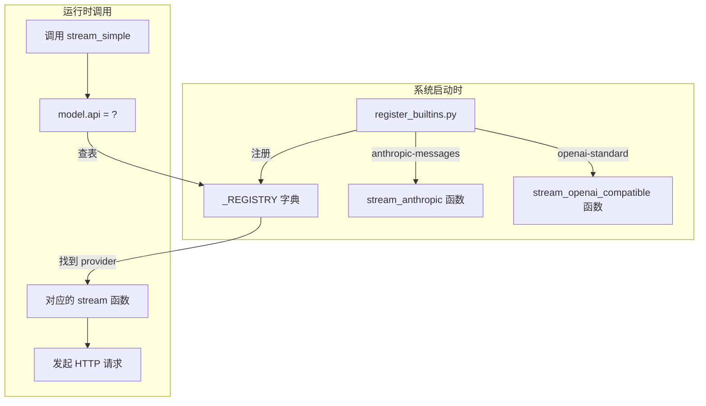
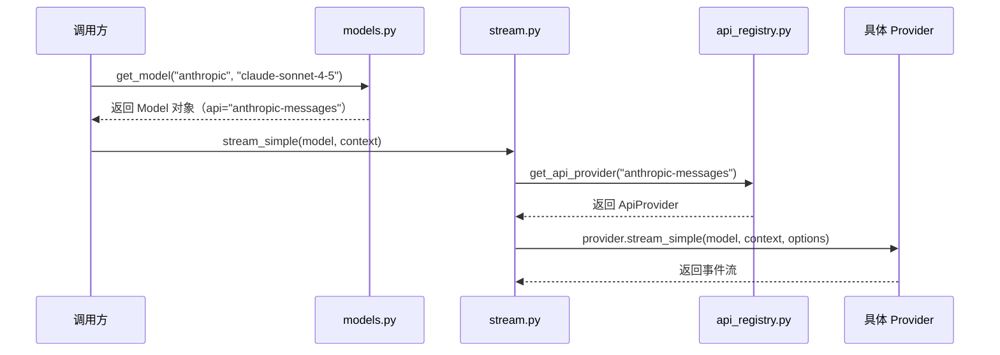

# Provider 注册与分发机制

Provider 注册与分发机制：`ai/api_registry.py`、`ai/models.py`、`ai/env_api_keys.py`、`ai/providers/register_builtins.py`

- 不同AI提供商有不同的API协议（Anthropic Messages、OpenAI Chat Completions），由 `api_registry.py` 中的 `_REGISTRY` 存储`API 协议名 -> 对应的协议调用实现`，即存储**不同类型的API协议的请求方式**；然后，由`stream.py` 中根据模型配置的 `model.api` 去 `_REGISTRY`查出api对应的调用实现
- **统一调用入口**：上层 Agent 不直接关心具体 API 协议，调用方只需要调用统一的 stream()、complete()、stream_simple()
- **降低扩展成本**：新增协议时，只需要实现新的 stream / stream_simple 并注册，不需要改调用方代码。

---

`_REGISTRY`示例：stream.py 会，也就是 stream_openai_compatible

```python
_REGISTRY = {
    "anthropic-messages": ApiProvider(
        api="anthropic-messages", # # 协议标识
        stream=stream_anthropic,
        stream_simple=stream_simple_anthropic,
    ),

    "openai-standard": ApiProvider(
        api="openai-standard",
        stream=stream_openai_compatible,
        stream_simple=stream_simple_openai_compatible,
    ),
}
```

某个模型配置：

```python
Model(
    id="glm-4",
    api="openai-standard",
    provider="zhipu",
    base_url="https://open.bigmodel.cn/api/paas/v4",
    ...
)
```

`stream.py`会用`model.api == "openai-standard"`，去 _REGISTRY 里找到`stream_openai_compatible`，然后调用它。model.provider == "zhipu" 则主要给具体实现内部用来找对应的 API Key。


----

## 添加新模型

不需要改`_REGISTRY`，只需要在models.py中的`_MODELS`里加一个 Model(...)：

- **前提**：模型使用的协议已经存在，比如anthropic-messages、openai-standard

```python
"qwen-max": Model(
    id="qwen-max",
    name="Qwen Max",
    api="openai-standard",
    provider="qwen",
    base_url="https://dashscope.aliyuncs.com/compatible-mode/v1",
    reasoning=False,
    input=["text", "image"],
    context_window=128_000,
    max_tokens=8192,
)
```

如果provider="qwen"，还需要在`env_api_keys.py`里支持读取它的 Key：

- 没必要，一般厂商都是支持anthropic-messages、openai-standard的

```python
if provider == "qwen":    
    return os.getenv("QWEN_API_KEY")
```


## 添加新API协议

新增一个API协议`api="my-new-api"`

1、在 src/ai/providers/ 下新增协议实现文件`my_new_api.py`，实现两个函数

```python
def stream_my_new_api(model, context, options):
    ...

def stream_simple_my_new_api(model, context, options):
    ...
```

2、在`register_builtins.py` 里，调用`register_api_provider(...)` 注册进去

- 调用方的代码`stream.py`完全不用改，这就是"开闭原则"——**对扩展开放，对修改关闭。**

```python
from .my_new_api import stream_my_new_api, stream_simple_my_new_api

register_api_provider(
    ApiProvider(
        api="my-new-api",
        stream=stream_my_new_api,
        stream_simple=stream_simple_my_new_api,
    )
)
```


## 整体流程图



## 源码精读

### API协议实现注册表`api_registry.py`

API协议实现注册表`api_registry.py`

```python
# 两个函数签名约束，类似Java的接口
# StreamFn 是完整流式调用函数，SimpleStreamFn 是简化流式调用函数。
# StreamFn接收3个参数，返回AssistantMessageEventStream
StreamFn = Callable[[Model, Context, StreamOptions | None], AssistantMessageEventStream]
# SimpleStreamFn接收3个参数，返回AssistantMessageEventStream
SimpleStreamFn = Callable[[Model, Context, SimpleStreamOptions | None], AssistantMessageEventStream]

@dataclass
class ApiProvider:
    """ 保存某个 API 协议的名称、这个协议对应的两个调用函数 """
    api: str # 协议标识，如 "anthropic-messages"
    stream: StreamFn # 完整流式调用函数
    stream_simple: SimpleStreamFn # 简化流式调用函数


# API 协议实现注册表：根据 API 协议名分发到具体请求实现函数的注册表。
_REGISTRY: dict[str, ApiProvider] = {}


def register_api_provider(provider: ApiProvider) -> None:
    """注册或覆盖某个 api 的 provider。"""
    _REGISTRY[provider.api] = provider


def get_api_provider(api: str) -> ApiProvider | None:
    """按 api 获取 provider；不存在返回 None。"""
    return _REGISTRY.get(api)


def clear_api_providers() -> None:
    """清空注册中心（通常用于测试或重置）。"""
    _REGISTRY.clear()

```


### 注册Provider`src/ai/providers/register_builtins.py`

文件最后那行 `register_builtin_api_providers()` 不在任何函数或 class 里面——它是"模块级代码"，在 `import` 时自动执行。这保证了只要你 `import ai`，两个 provider 就已经注册好了。

- 执行顺序：
  - import ai
      -> 执行 `src/ai/__init__.py`
      -> 调用 register_builtin_api_providers()
      -> 导入 src/ai/providers/register_builtins.py
      -> 执行该文件顶层代码
      -> 文件末尾调用 register_builtin_api_providers()
      -> provider 被注册

```python
def register_builtin_api_providers() -> None:
    """注册两个内置协议。"""
    # Anthropic Messages 协议
    register_api_provider(
        ApiProvider(
            api="anthropic-messages",        # 协议名
            stream=stream_anthropic,          # 对应的实现函数
            stream_simple=stream_simple_anthropic,
        )
    )
    # OpenAI 标准协议
    register_api_provider(
        ApiProvider(
            api="openai-standard",
            stream=stream_openai_compatible,
            stream_simple=stream_simple_openai_compatible,
        )
    )

# 关键：模块加载时就自动注册！
# 当你 import ai 的时候，这行代码就会执行
register_builtin_api_providers()
```


### 协议具体的流式实现`src/ai/providers/anthropic.py` `src/ai/providers/openai_compatible.py`


### 模型注册表`models.py`

```python
# 模型注册表
_MODELS: dict[str, dict[str, Model]] = {
    # anthropic provider 
    "anthropic": {
        "claude-sonnet-4-5": Model(
            id="claude-sonnet-4-5",
            name="Claude Sonnet 4.5",
            api="anthropic-messages",
            provider="anthropic",
            base_url="https://api.anthropic.com",
            reasoning=True,
            input=["text", "image"],
            context_window=200_000,
            max_tokens=8192,
        ),
        "glm-4.7": Model(
            id="glm-4.7",
            name="GLM-4.7",
            api="anthropic-messages",
            provider="anthropic",
            base_url="https://open.bigmodel.cn/api/anthropic",
            reasoning=True,
            input=["text", "image"],
            context_window=200_000,
            max_tokens=8192,
        ),
    },
    # openai provider
    "openai-standard": {
        "gpt-4o-mini": Model(
            id="gpt-4o-mini",
            name="GPT-4o mini",
            api="openai-standard",
            provider="openai-standard",
            base_url="https://api.openai.com/v1",
            reasoning=False,
            input=["text", "image"],
            context_window=128_000,
            max_tokens=16_384,
        ),
        "deepseek-v4-pro": Model(
            id="deepseek-v4-pro",
            name="DeepSeek V4 Pro",
            api="openai-standard",
            provider="openai-standard",
            base_url="https://api.deepseek.com",
            reasoning=True,
            input=["text", "image"],
            context_window=200_000,
            max_tokens=8192,
        ),
    },
}


def get_model(provider: str, model_id: str) -> Model:
    """获取单个模型，找不到会抛 KeyError。"""
    try:
        return _MODELS[provider][model_id]
    except KeyError as exc:
        raise KeyError(f"Unknown model: {provider}/{model_id}") from exc


def get_models(provider: str) -> list[Model]:
    """获取某 provider 的全部模型。"""
    return list(_MODELS.get(provider, {}).values())


def get_providers() -> list[str]:
    """列出当前内置 provider。"""
    return list(_MODELS.keys())

```


### 读取API Key`env_api_keys.py`


不同的供应商对应不同的环境变量名，`os.getenv("XXX")` 从系统环境变量里读取值。

```python
"""
统一读取环境变量中的 API Key。
"""

import os


def get_env_api_key(provider: str) -> str | None:
    """根据 provider 名，从环境变量里找对应的 API Key。"""
    # Anthropic provider
    if provider == "anthropic":
        # return "9d96c1c9f4cb41d1aa6f55b0641478bc.stGL7zCVisZi0I68"
        return os.getenv("ANTHROPIC_API_KEY")
    # OpenAI 标准/兼容 provider
    if provider in {"openai", "openai-standard"}:
        return os.getenv("OPENAI_API_KEY")
    return None
```


## 两个注册表`_REGISTRY、_MODEL`是怎么协作的？

**两层查找**。

1. 第一层：通过 `provider + model_id` 找到 `Model` 对象
2. 第二层：通过 `Model.api` 找到对应的 `ApiProvider` 实现



_MODELS：有哪些模型配置

```
_MODELS: dict[str, dict[str, Model]] = {
    "anthropic": {
        "claude-sonnet-4-5": Model(api="anthropic-messages", provider="anthropic", ...),
        "glm-4.7": Model(api="anthropic-messages", provider="anthropic", ...),
    },
    "openai-standard": {
        "gpt-4o-mini": Model(api="openai-standard", provider="openai-standard", ...),
        "deepseek-v4-pro": Model(api="openai-standard", provider="openai-standard", ...),
    },
}
```

_REGISTRY：某种 API 协议该用哪个实现函数

```
_REGISTRY: dict[str, ApiProvider] = {
    "anthropic-messages": ApiProvider(
        api="anthropic-messages",
        stream=stream_anthropic,
        stream_simple=stream_simple_anthropic,
    ),
    "openai-standard": ApiProvider(
        api="openai-standard",
        stream=stream_openai_compatible,
        stream_simple=stream_simple_openai_compatible,
    ),
}
```


## 小白避坑指南

### `__main__.py`和__`init__py`的作用是什么，怎来的？自己写的吗？还是说自动生成的？

`__init__.py` 和 __`main__.py` 都是 Python 约定识别的特殊文件，一般是项目作者自己写的，不是 Python 运行时自动生成的。

- `__init__.py`：这个目录作为“包”被导入时执行，常用于统一导出、初始化注册。
- `__main__.py`：这个包被 python -m 包名 运行时执行，常用于启动 CLI 或服务。

`__init__.py` 的作用是让**目录成为一个 Python 包并定义“导入这个包时发生什么”**

`src/ai/__init__.py`不只是标记包，它还把 complete、stream、Model、Provider 等对象统一导出，这样外部可以写：

```
from ai import stream, Model
```

而不用写更长的：

```
from ai.stream import stream 
from ai.types import Model
```

同时它最后还调用了 register_builtin_api_providers()，所以 import ai 时会顺便注册内置 provider。你看到的确实是手写逻辑。

`__main__.py` 的作用是**让一个包可以被 python -m 包名 直接运行**。比如 src/coding_agent/__main__.py (line 1) 内容是：

```python
from .cli import main raise 
	SystemExit(main())
```

所以执行：

```
python -m coding_agent
```

就等价于进入 coding_agent.cli.main()。类似地，src/im/__main__.py (line 1) 也是为了支持：

```
python -m im
```


### 统一导出包

统一导出：把分散在不同 .py 文件里的方法，集中挂到 ai 包的入口上；complete、stream、Model、Provider 实际定义在别的文件里，但 `ai/__init__.py` 把它们集中暴露出来，让使用者可以从 ai 这个统一入口直接导入。

比如原本这些对象可能分别在不同模块里：

```python
# src/ai/stream.py
def stream(...):
    ...

def complete(...):
    ...
    
# src/ai/types.py
class Model:
    ...

class Provider:
    ...
```

如果没有在 `src/ai/__init__.py` 里统一导出，别人使用时要这样写：

```
from ai.stream import stream, complete
from ai.types import Model, Provider
```

但你的 `src/ai/__init__.py` 里写了类似这样的代码：

```
from .stream import complete, stream
from .types import Model, Provider
```

于是外部就可以直接写：

```
from ai import stream, complete, Model, Provider
```

文件里的 `__all__ `是在声明：

```
__all__ = [
    "complete",
    "stream",
    "Model",
    "Provider",
]
```

它主要影响：

```
from ai import *
```

表示 *** 导入时允许导出哪些名字**。它也有一点“告诉别人这些是公共 API”的文档作用。


### 坑 1：`api` 和 `provider` 傻傻分不清

- `api`（协议）：决定 HTTP 请求的格式。`"anthropic-messages"` 走 Anthropic 的 SSE 格式，`"openai-standard"` 走 OpenAI 的 SSE 格式。
- `provider`（供应商）：决定用哪个 API Key。

一个实际的例子：智谱 GLM 兼容 Anthropic 协议，所以 `api = "anthropic-messages"`，但它的 Key 需要通过 `ANTHROPIC_API_KEY` 传入。

### 坑 2：为什么用字典而不用 if-else？

初学者可能会写这样的代码：

```python
# 不好的写法
if model.api == "anthropic-messages":
    return stream_anthropic(model, context)
elif model.api == "openai-standard":
    return stream_openai_compatible(model, context)
```

问题是：每次新增一个 provider 都要改这段 if-else。而用注册表：

```python
# 好的写法
provider = _REGISTRY[model.api]
return provider.stream(model, context)
```

新增 provider 时只需要 `register_api_provider(...)`，这段代码完全不用动。

### 坑 3：模块级代码的执行时机

`register_builtins.py` 最后一行 `register_builtin_api_providers()` 是在 `import` 时执行的。这意味着：

```python
# 只要执行了这行 import，provider 就已经注册好了
from ai import stream_simple

# 此时 _REGISTRY 里已经有 "anthropic-messages" 和 "openai-standard" 了
```

如果你在测试中想用自定义的 mock provider，可以先调 `clear_api_providers()` 清空，再注册你自己的。
