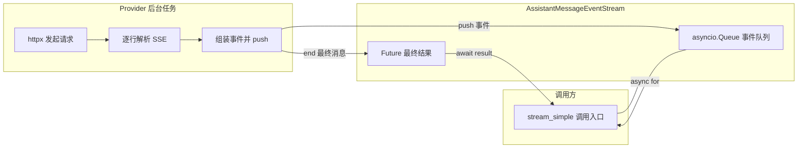

**流式响应与事件流**：`src/ai/stream.py`、`src/ai/event_stream.py`、`src/ai/providers/anthropic.py`、`src/ai/providers/openai_compatible.py`、`src/ai/providers/_common.py`

- **流式响应Streaming**：一个词一个词蹦出来
- 为什么要用流式？
  - **用户体验好**：用户马上就能看到 AI 在"打字"，而不是等十几秒
  - **可以随时中断**：如果 AI 跑偏了，可以半路喊停
  - **省资源**：不用在内存里存一整个巨大的回复


## 整体架构图




## 源码精读

### 统一调用入口`stream.py`

**统一模型调用入口**：不直接请求 OpenAI/Anthropic，而是**根据 model.api 找到对应 provider，然后把调用转发过去**

- _resolve_provider(api)：从注册表里按 api协议类型 找 provider；找不到就抛错。
- stream(model, context, options)：**标准流式接口**，**返回 AssistantMessageEventStream，调用方可以 async for 逐步消费事件**。
- complete(model, context, options)：**非流式封装**，内部还是走 stream()，但是使用**await s.result() 等最终完整回复**。
- stream_simple(...)：简化版流式接口，额外支持 reasoning="low" 这种快捷参数，然后调用 provider 的 stream_simple。
- complete_simple(...)：简化版完整回复接口，内部走 stream_simple() 后等待最终结果。

```python
def _resolve_provider(api: str):
    """ 根据 api 字段找到对应的 provider 实现。 """
    provider = get_api_provider(api)
    if provider is None:
        raise RuntimeError(f"No API provider registered for api: {api}")
    return provider


def stream(model: Model, context: Context, options: StreamOptions | None = None) -> AssistantMessageEventStream:
    """立刻返回一个 AssistantMessageEventStream，
    可以一边生成一边消费事件，比如 text_delta、toolcall_delta"""
    provider = _resolve_provider(model.api)
    return provider.stream(model, context, options)


async def complete(model: Model, context: Context, options: StreamOptions | None = None) -> AssistantMessage:
    """返回一次完整回答,内部还是走流式,基于 stream.result()，但等到最终结果。"""
    s = stream(model, context, options)
    return await s.result()


def stream_simple(
    model: Model,
    context: Context,
    options: SimpleStreamOptions | None = None,
    *,
    reasoning: str | None = None,
) -> AssistantMessageEventStream:
    """
    简化版流式接口。

    reasoning 提供快捷写法：stream_simple(..., reasoning="low")
    """
    # 第一步：根据 model.api 找到对应的 provider 实现
    provider = _resolve_provider(model.api)
    # 第二步：把 reasoning 快捷参数写入 options
    effective_options = options or SimpleStreamOptions()
    if reasoning is not None:
        effective_options.reasoning = reasoning
    # 第三步：调用 provider 的 stream_simple 函数
    return provider.stream_simple(model, context, effective_options)


async def complete_simple(
    model: Model,
    context: Context,
    options: SimpleStreamOptions | None = None,
    *,
    reasoning: str | None = None,
) -> AssistantMessage:
    """简化版完整回答接口。"""
    s = stream_simple(model, context, options, reasoning=reasoning)
    return await s.result()

```

**关键理解**：`stream_simple` 返回的是一个 `AssistantMessageEventStream` 对象。这个对象有两种用法：

```python
# 用法 1：流式消费（像看直播弹幕）
s = stream_simple(model, context)
async for event in s:
    if event["type"] == "text_delta":
        print(event["delta"], end="")  # 一个词一个词打印

# 用法 2：等待拿到最终结果（像看录播）
msg = await s.result()
print(msg.content)  # 一次性拿到完整回复
```


### 事件流容器（`event_stream.py`）

流式系统的核心：生产者-消费者，统一封装“AI 回复流”

- Provider不断把事件放上Queue
- 消费者逐步消费`async for`
- Provider放完最后一个事件后，放上一个标记`_SENTINEL`表示结束

```python
_SENTINEL = object()


class AssistantMessageEventStream:
    def __init__(self) -> None:
        # 事件队列：生产者 push 事件进来，消费者 async for 取出去
        # 保存流式事件：
        self._queue: "asyncio.Queue[Any]" = asyncio.Queue()
        # 保存最终完整的 AssistantMessage：用于一次性获取完整消息。
        self._result: "asyncio.Future[AssistantMessage]" = asyncio.get_event_loop().create_future()
        self._closed = False

    def push(self, event: dict[str, Any]) -> None:
        """生产者调用：provider 生成一小段内容后，往队列中推送一个事件（text_delta/toolcall_delta/...）。"""
        if self._closed:
            return
        self._queue.put_nowait(event)

    def end(self, message: AssistantMessage) -> None:
        """生产者调用：流正常结束，写入最终消息，并放入_SENTINEL通知 async for 停止。"""
        if self._closed:
            return
        self._closed = True
        if not self._result.done():
            self._result.set_result(message)
        self._queue.put_nowait(_SENTINEL)

    def fail(self, error: Exception, fallback: Optional[AssistantMessage] = None) -> None:
        """
        生产者调用：流异常结束。

        fallback 存在时，result() 仍返回 fallback；
        否则 result() 抛出异常。
        """
        if self._closed:
            return
        self._closed = True
        if fallback is not None:
            if not self._result.done():
                self._result.set_result(fallback)
        else:
            if not self._result.done():
                self._result.set_exception(error)
        self._queue.put_nowait(_SENTINEL)

    async def result(self) -> AssistantMessage:
        """消费者调用：等待并返回最终 AssistantMessage。"""
        return await self._result

    def __aiter__(self) -> AsyncIterator[dict[str, Any]]:
        return self._iter_events()

    async def _iter_events(self) -> AsyncIterator[dict[str, Any]]:
        """ 消费者调用：逐个取出事件，直到流结束。 """
        while True:
            item = await self._queue.get()
            if item is _SENTINEL:
                break
            yield item

```


### Anthropic Provider 实现`anthropic.py`核心片段

只看关键流程：**把 Anthropic 的 SSE 流式响应，转换成项目内部统一的事件流 AssistantMessageEventStream**。

- `stream` 立即返回给调用方，此时数据还没到，生产者和消费者并行工作
- SSE（Server-Sent Events）是 AI API 常用的流式格式，每一行以 `event:` 或 `data:` 开头
- 调用 stream_anthropic()
    -> 立即返回 AssistantMessageEventStream
    -> 后台 _run() 请求 Anthropic
    -> 逐行解析 SSE event/data
    -> 按 content block 组装 text/thinking/toolCall
    -> 持续 push 统一事件
    -> done/error 后 end，result() 返回最终 AssistantMessage

```python
def stream_anthropic(model, context, options=None):
    stream = AssistantMessageEventStream()   # 1. 创建事件流容器

    async def _run():
        out = empty_assistant_message(...)    # 2. 创建一个空的"半成品"消息

        # 3. 准备 HTTP 请求
        api_key = options.api_key or get_env_api_key(model.provider)
        headers = {"x-api-key": api_key, ...}
        payload = {
            "model": model.id,
            "messages": to_anthropic_messages(context),  # 统一格式 → Anthropic 格式
            "stream": True,                               # 关键：告诉 API 要流式
        }

        # 4. 发起 HTTP 流式请求
        async with httpx.AsyncClient() as client:
            async with client.stream("POST", url, json=payload) as response:
                stream.push({"type": "start", "partial": out})

                # 5. 逐行读取 SSE 数据
                async for raw_line in response.aiter_lines():
                    line = raw_line.strip()
                    if line.startswith("event:"):
                        current_event = line[6:].strip()  # 事件类型
                    elif line.startswith("data:"):
                        data = json.loads(line[5:])        # 事件数据

                        # 6. 根据事件类型组装消息
                        if current_event == "content_block_start":
                            # 新内容块开始（文本/思考/工具调用）
                            ...
                        elif current_event == "content_block_delta":
                            # 内容增量（"一个词一个词"来的部分）
                            text = delta.get("text", "")
                            text_blocks[idx].text += text
                            stream.push({
                                "type": "text_delta",
                                "delta": text,      # 增量文本
                                "partial": out,       # 当前半成品
                            })
                        elif current_event == "content_block_stop":
                            # 内容块结束
                            ...

                # 7. 全部读完，推送完成事件
                stream.push({"type": "done", ...})
                stream.end(out)

    asyncio.create_task(_run())   # 8. 在后台异步执行
    return stream                  # 9. 立即返回事件流（不等结果）
```


### 消息格式转换`_common.py`

不同厂商的 API 格式不同，`_common.py` 负责在"统一格式"和"厂商格式"之间转换：

- 统一接口层：上层代码只操作 `UserMessage`、`AssistantMessage`、`ToolResultMessage`，不用关心每家 API 到底要什么格式。

```python
def to_anthropic_messages(context: Context) -> list[dict]:
    """把 XingClaw 的统一消息格式转成 Anthropic 需要的格式。"""
    out = []
    for msg in context.messages:
        if isinstance(msg, UserMessage):
            out.append({"role": "user", "content": msg.content})
        elif isinstance(msg, ToolResultMessage):
            # 注意：Anthropic 把 tool result 放在 user 消息里！
            out.append({
                "role": "user",
                "content": [{"type": "tool_result", "tool_use_id": msg.tool_call_id, ...}]
            })
        ...
    return out

def to_openai_messages(context: Context) -> list[dict]:
    """把 XingClaw 的统一消息格式转成 OpenAI 需要的格式。"""
    out = []
    for msg in context.messages:
        ...
        elif isinstance(msg, ToolResultMessage):
            # 注意：OpenAI 用专门的 "tool" 角色！
            out.append({
                "role": "tool",
                "tool_call_id": msg.tool_call_id,
                ...
            })
        ...
    return out
```


## 事件类型速查表

在流式过程中的事件：

| 事件类型 | 含义 | 携带数据 |
|---------|------|---------|
| `start` | 流开始 | `partial`（空消息） |
| `text_start` | 开始一段文本 | `contentIndex` |
| `text_delta` | 文本增量 | `delta`（新增的文字） |
| `text_end` | 一段文本结束 | `content`（完整文本） |
| `thinking_start` | 开始思考 | `contentIndex` |
| `thinking_delta` | 思考内容增量 | `delta` |
| `thinking_end` | 思考结束 | `content` |
| `toolcall_start` | 开始工具调用 | `contentIndex` |
| `toolcall_delta` | 工具参数增量 | `delta`（JSON 片段） |
| `toolcall_end` | 工具调用结束 | `toolCall`（完整调用） |
| `done` | 全部结束 | `reason`、`message` |
| `error` | 出错 | `error` |

## 小白避坑指南

### 坑 1：为什么 `stream_anthropic` 末尾用 `asyncio.create_task` 而不是 `await`？

如果用 `await _run()`，调用方要等到整个 HTTP 请求完成才能拿到 `stream`——那就不是"流式"了。`create_task` 让 `_run()` 在后台跑，`stream` 立即返回，调用方可以马上开始 `async for`。

```python
asyncio.create_task(_run())  # 后台执行，不阻塞
return stream                 # 立即返回
```


### 坑 2：`async for` 和普通 `for` 有什么区别？

`async for` 会在"没有数据时自动暂停等待"，有新数据时自动恢复。这是 Python 异步编程的核心模式。

```python
# 普通 for——遍历列表，数据全在内存里
for item in [1, 2, 3]:
    print(item)

# async for——遍历异步生成器，数据可能还在路上
async for event in stream:
    print(event)  # 没事件时会自动等待，有事件时继续
```


### 坑 3：SSE 格式到底长什么样？

Anthropic 返回的原始数据大概长这样：每一对 `event:` + `data:` 就是一个 SSE 事件。代码逐行解析这些行，组装成 XingClaw 统一的事件格式。

```
event: message_start
data: {"type":"message_start","message":{"id":"msg_123",...}}

event: content_block_start
data: {"type":"content_block_start","index":0,"content_block":{"type":"text"}}

event: content_block_delta
data: {"type":"content_block_delta","index":0,"delta":{"type":"text_delta","text":"你"}}

event: content_block_delta
data: {"type":"content_block_delta","index":0,"delta":{"type":"text_delta","text":"好"}}

event: content_block_stop
data: {"type":"content_block_stop","index":0}

event: message_stop
data: {"type":"message_stop"}
```

### 坑 4：`parse_partial_json` 是干什么的？

工具调用的参数是 JSON 格式，但流式传输时 JSON 是一片一片来的：

```
第一片：{"path"
第二片：: "/src/
第三片：main.py"}
```

拼在一起才是完整的 `{"path": "/src/main.py"}`。`parse_partial_json` 尝试解析当前已收到的所有片段，解析失败就返回空字典——不会报错，等下一片来了再试。
