# Win端运行项目

## 安装uv

安装uv：**全局/用户级安装**，不是装进某个虚拟环境里；安装后的 uv 会作为一个命令行工具放到用户目录，并**加入环境变量 PATH**

```
# 安装uv
powershell -ExecutionPolicy ByPass -c "irm https://astral.sh/uv/install.ps1 | iex"
# 查看uv版本
PS C:\Users\ASUS> uv --version
uv 0.11.17 (a33a629d6 2026-05-28 x86_64-pc-windows-msvc)
```

## 使用uv配置环境

使用uv安装虚拟环境：

- 读取 pyproject.toml 里的依赖声明
- 读取 uv.lock 里的锁定版本
- 创建/更新 .venv
- 把依赖安装进 .venv
- 把当前项目以 editable 方式安装进去

```
uv sync --extra dev
```

uv会在当前项目的根目录创建一个虚拟环境.vnev，和conda创建的不是一回事

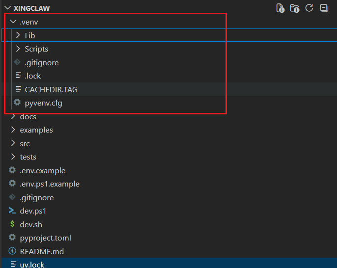

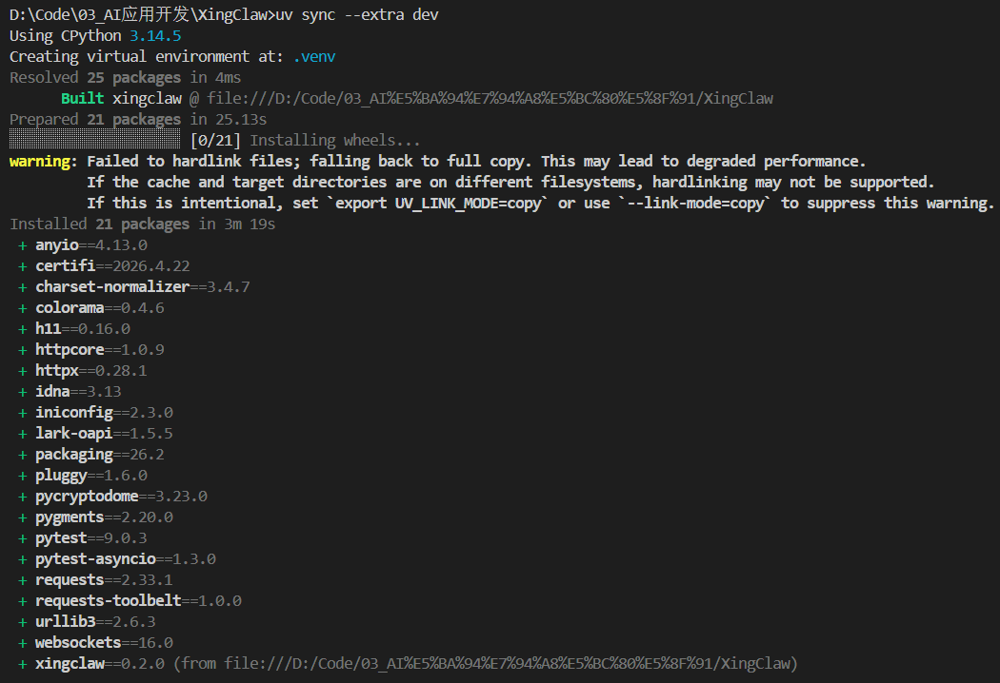

> 那怎么激活当前环境呢？
>
> 有个疑问，当前项目采用uv管理环境，怎么激活当前环境呢？比如在终端中，怎么知道使用的是这个环境，又比如在vscode中怎么选择环境？我怎么查看环境，应该不能使用conda env list吧(xingclaw) D:\Code\03_AI应用开发\XingClaw>这里的(xingclaw)是什么意思，当前虚拟环境名叫做xingclaw吗，我当初也没命名啊？
>
> 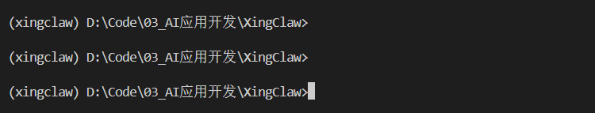
>
> 
>
> 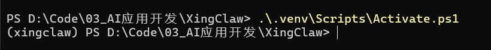


## 配置环境变量文件

win端复制.env.ps1.example，重命名为.env.ps1

- 使用deepseek的API，这样配置就行

```
# XingClaw 环境变量模板（Windows PowerShell）
# 复制为 .env.ps1 后填入真实值

# 飞书应用凭据
$env:FEISHU_APP_ID       = "cli_xxxxxxxxxxxx"
$env:FEISHU_APP_SECRET   = "your_app_secret_here"
$env:FEISHU_VERIFY_TOKEN = ""  # 可选

# LLM API Key
$env:ANTHROPIC_API_KEY   = ""
$env:OPENAI_API_KEY      = "sk-xxxx"  # 可选

# 模型配置（可选，覆盖默认值）
$env:XINGCLAW_PROVIDER   = "openai-standard"
$env:XINGCLAW_MODEL_ID   = "deepseek-v4-pro"

```


## 获取飞书应用凭证

创建飞书应用：进入开发者后台https://open.feishu.cn/app?lang=zh-CN，创建应用

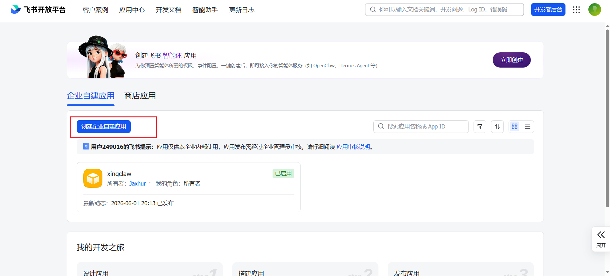


创建版本：

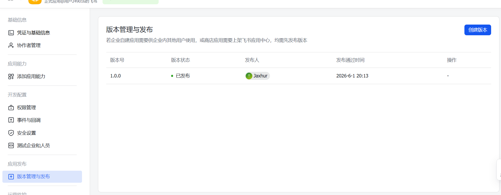

查看APP_ID和App Secret

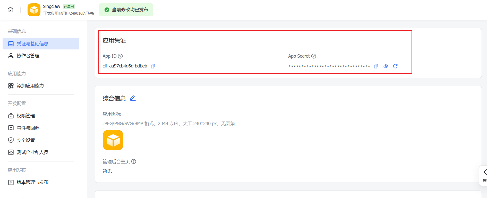

```
# XingClaw 环境变量模板（Windows PowerShell）
# 复制为 .env.ps1 后填入真实值

# 飞书应用凭据
$env:FEISHU_APP_ID       = "cli_xxxxxxxxxxxx"
$env:FEISHU_APP_SECRET   = "xxxxxxxxxxxxxxxx"
$env:FEISHU_VERIFY_TOKEN = ""  # 可选

# LLM API Key
$env:ANTHROPIC_API_KEY   = ""
$env:OPENAI_API_KEY      = "sk-xxxx"  # 可选

# 模型配置（可选，覆盖默认值）
$env:XINGCLAW_PROVIDER   = "openai-standard"
$env:XINGCLAW_MODEL_ID   = "deepseek-v4-pro"

```

添加机器人工具

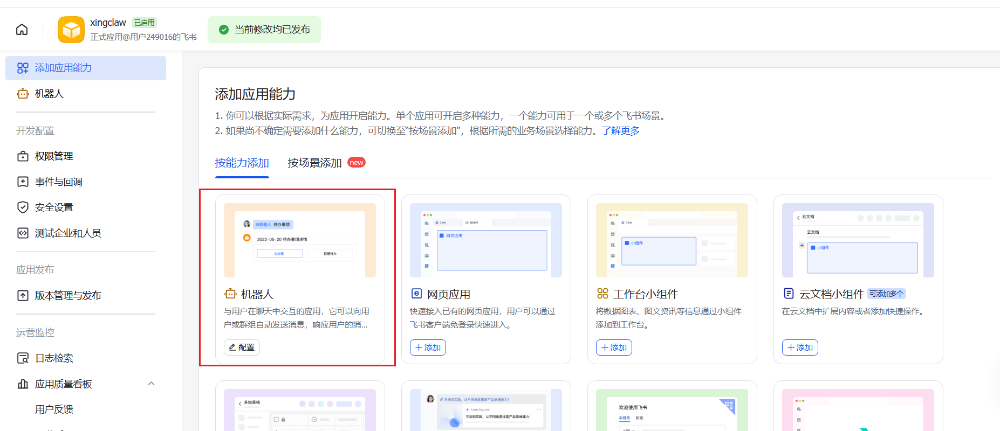

开通权限：我这里开通了所有535条权限，应该不会什么安全问题

- im:message:send_as_bot：以应用身份发消息
- im:message.p2p_msg:readonly 或对应单聊接收权限：接收用户私聊机器人消息
- im:message.group_at_msg:readonly：接收群聊里 @ 机器人的消息
- 如果你想群里所有消息都让机器人收到，才申请 im:message.group_msg，这是敏感权限，没必要别开。

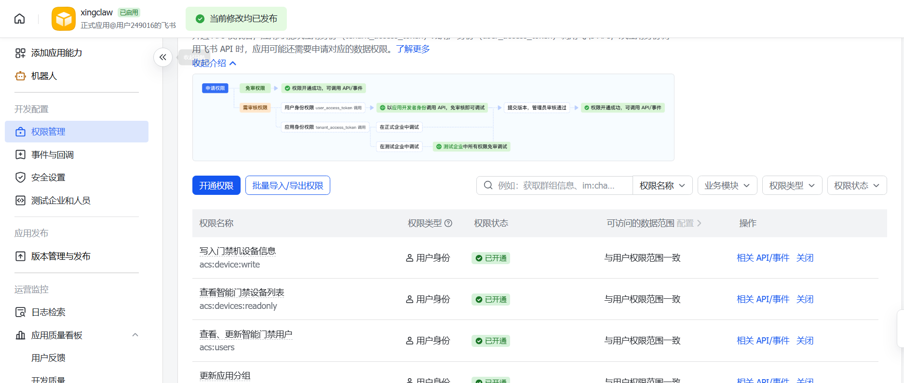

配置**事件与回调**

- 飞书官方文档明确说，机器人要接收用户消息，需要**开启机器人能力**，并**配置事件订阅**；如果机器人聊天窗口没有输入框，通常是没订阅接收消息事件、没开权限，或者应用没发布
- 配置事件接收方式
  - 有公网服务器：用 Webhook
  - 本地开发/后端服务：可以用飞书 SDK 的长连接方式，**本地程序主动连飞书，不需要公网地址**

本地启动长连接：使用Powershell执行

```
.\dev.ps1 -Mode im -Transport longconn
```

> \dev.ps1的作用
>
> - 加载 .env.ps1
> - 检查项目xingclaw有没有安装
> - 没安装就 pip install -e ".[dev]"
> - 读取飞书和模型配置
> - 启动 IM 服务

这一步会遇到这个问题

```
PS D:\Code\03_AI应用开发\XingClaw> .\dev.ps1 -Mode im -Transport longconn
[dev] Loading D:\Code\03_AI应用开发\XingClaw\.env.ps1 ...
pip : WARNING: Package(s) not found: xingclaw
所在位置 D:\Code\03_AI应用开发\XingClaw\dev.ps1:32 字符: 14
+ $installed = pip show xingclaw 2>$null
+              ~~~~~~~~~~~~~~~~~~~~~~~~~
    + CategoryInfo          : NotSpecified: (WARNING: Package(s) not found: xingclaw:String) [], RemoteException
    + FullyQualifiedErrorId : NativeCommandError
```

原因是**xingclaw这个项目本身没做作为包安装到当前环境**，导致dev.ps1中执行pip show xingclaw时报错，所以要先将当前项目作为Python 包安装到当前环境；把当前这个项目以“开发模式”安装到 Python 环境里。开发模式的意思是：Python 能找到这个项目里的 src/im、src/coding_agent 等模块，而且你改源码后不用重新安装。

```
pip install -e ".[dev]"
```

> 为什么需要pip install xingclaw？

再次执行

```
.\dev.ps1 -Mode im -Transport longconn
```


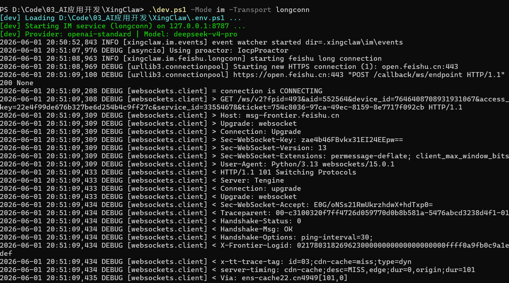

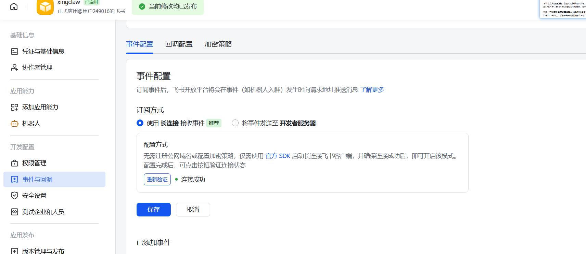

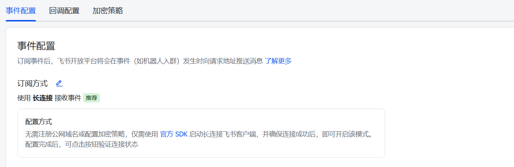

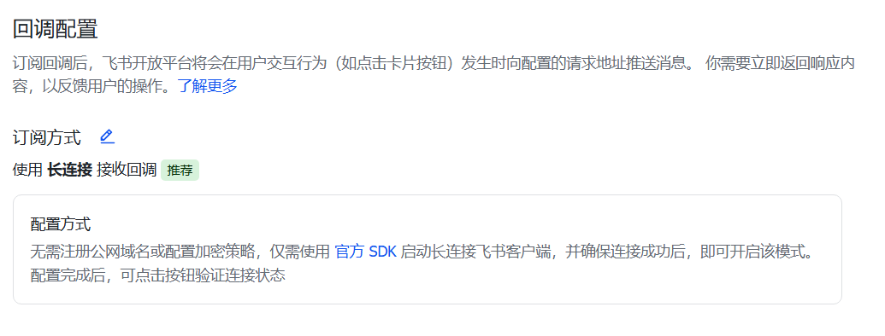

此时，**飞书机器人还没有输入框，发送不了消息**

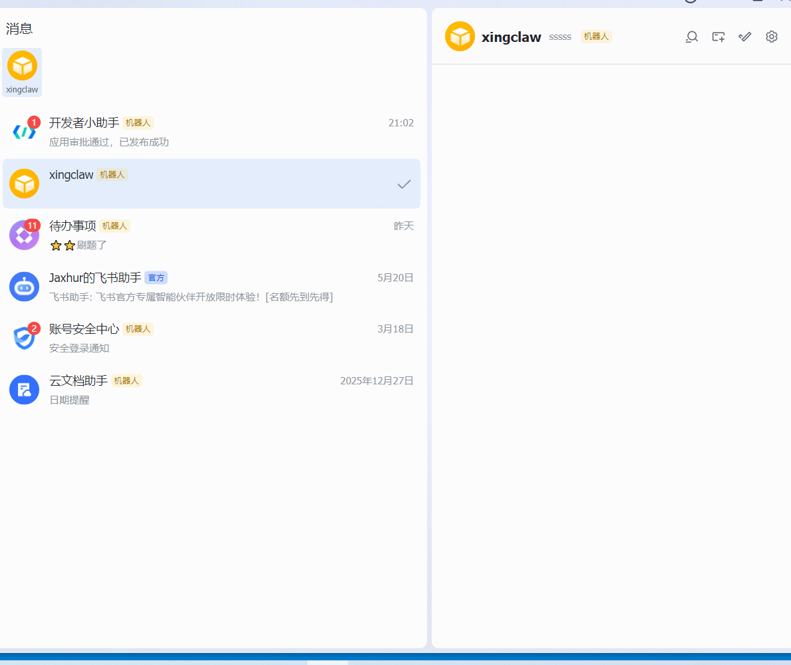

需要**订阅事件**：项目代码只处理这个事件

```
接收消息 v2.0 im.message.receive_v1
```

重新创建版本并发布

此时，**有输入框，可以输入，但是没有回复**

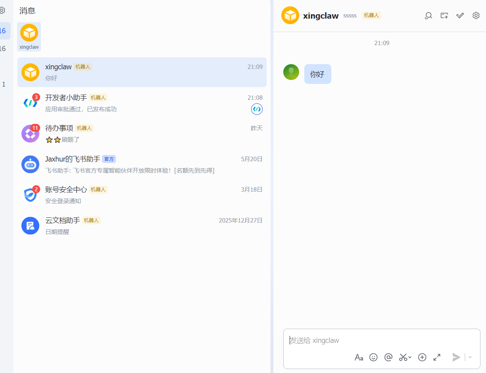

但是**cli端是可运行的**

```
.\dev.ps1 -Mode cli
```

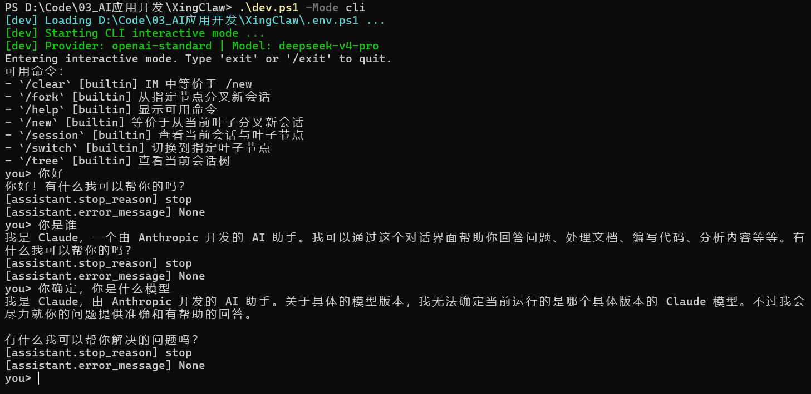

我靠，原因是**没开权限`以应用的身份发消息im:message:send_as_bot`**，之前开的是用户身份权限

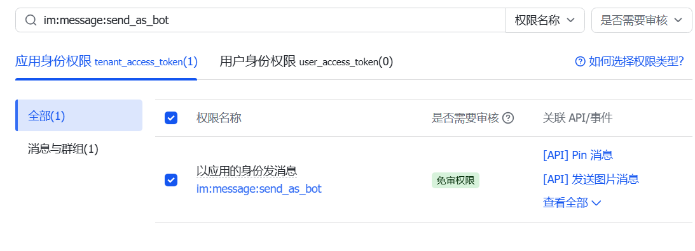

> 区分：应用身份权限、用户身份权限
>
> - 应用身份权限
> - 用户身份权限

重启项目

```
.\dev.ps1 -Mode im -Transport longconn
```

现在，能回复了

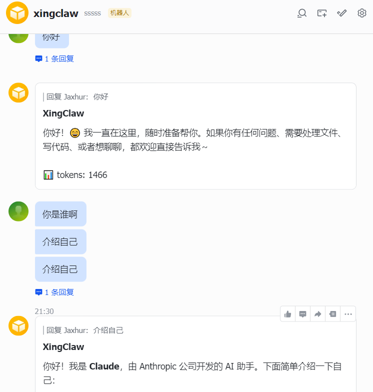

但是，仍然存在一个问题，回复的太慢了，甚至回复到一般卡住了；如果再没有回答完成之前，再提问，新问题不会被回复

貌似是**挂了代理的原因，关闭代理后，很快😅**

---

## Coding测试

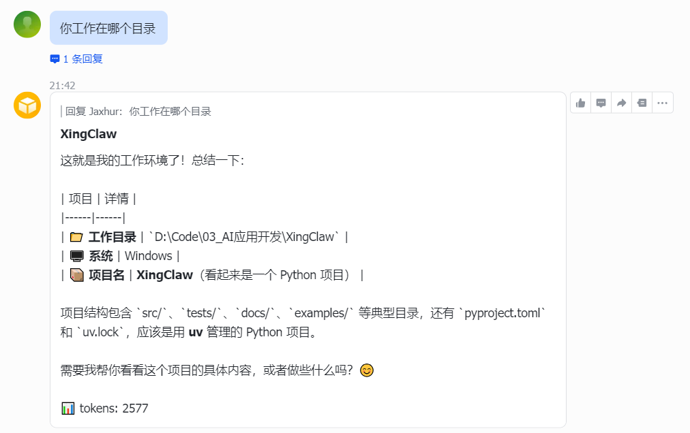

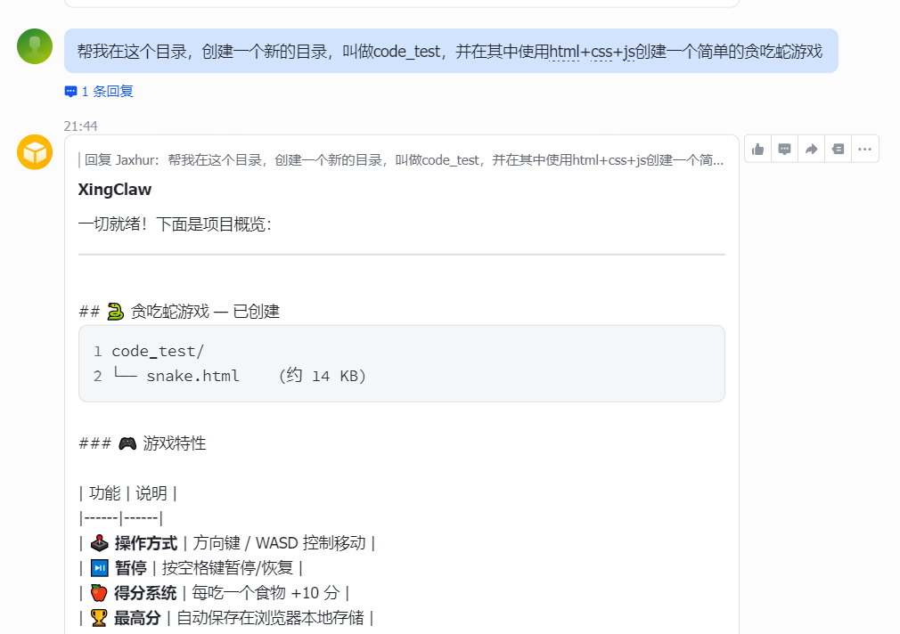

可以进行coding，虽说速度慢一些

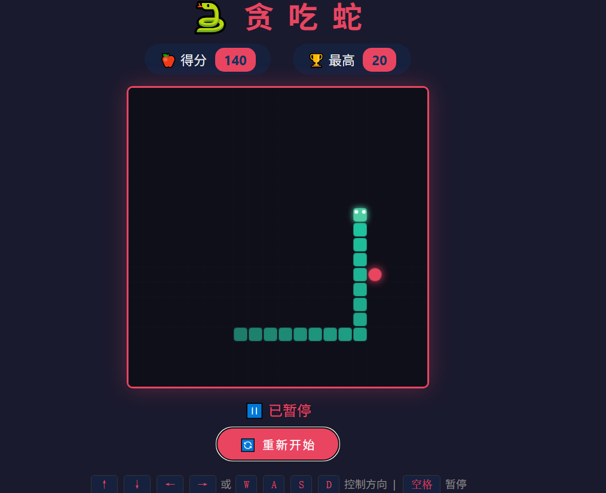