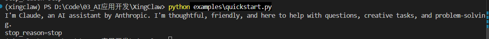
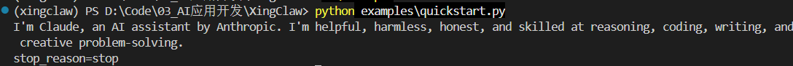

# quickstart.py

## 代码

quickstart.py：演示最小对话流程

- 选模型
- 准备上下文
- 请求模型，流式返回，逐步消费文本增量text_delta
- 拿最终消息

```python
import asyncio
import time

# 示例脚本：演示最小对话流程
# 1) 选模型
# 2) 准备上下文
# 3) 逐步消费 文本增量 text_delta
# 4) 拿最终消息
from ai import Context, TextContent, Tool, UserMessage, get_model, stream_simple


async def main() -> None:
    # 1) 选模型
    # model = get_model("anthropic", "glm-4.7")
    model = get_model("openai-standard", "deepseek-v4-pro")

    # 2) 准备上下文：系统提示 + 用户消息 + 可选工具
    context = Context(
        # 系统提示
        system_prompt="You are a helpful assistant.",
        # 用户消息
        messages=[
            UserMessage(
                # 当前 examples/quickstart.py 只能让模型“提出要调用工具”，即打印出stop_reason=toolUse，但不会真正执行工具。
                # content=[TextContent(text="tell me current time")],
                content=[TextContent(text="introduce yourself in 20 words")],
                timestamp=int(time.time() * 1000),
            )
        ],
        # 可选工具
        tools=[
            Tool(
                name="get_time",
                description="Get current UTC time",
                parameters={"type": "object", "properties": {}, "additionalProperties": False},
            )
        ],
    )

    # 3) 调用大模型，并一边生成一边打印回复内容
    s = stream_simple(model, context, reasoning="low") # 流式请求
    # 异步地从模型响应里一段一段取事件，模型像打字一样分段返回，每一小段都会变成一个 event
    async for event in s:
        # 只处理“文本增量”事件
        # event["delta"]：本次新增的文本片段
        # end=""：打印完不要自动换行
        # flush=True：立刻显示，不要等缓冲区满了再显示
        if event["type"] == "text_delta":
            print(event["delta"], end="", flush=True)

    # 4) 拿最终消息(模型最终回复内容+停止原因+错误信息+token使用量等)
    # 停止原因: 正常结束stop/模型调用工具toolUse/达到长度限制length/用户中途取消aborted/请求报错error等
    msg = await s.result()
    print(f"\nstop_reason={msg.stop_reason}") 
    if msg.stop_reason in {"error", "aborted"}:
        print(f"error_message={msg.error_message}")


if __name__ == "__main__":
    # 启动异步事件循环，执行 main 里面的模型调用流程。
    asyncio.run(main())

```

## 执行流程

先安装项目

```
pip install -e ".[dev]"
```

加载环境变量

```
. .\.env.ps1
```

运行`python examples\quickstart.py`之前，有几个地方需要修改

```python
model = get_model("openai-standard", "deepseek-v4-pro")
```

执行

```
python examples\quickstart.py
```

执行结果



当前的quickstart能让模型“提出要调用工具”，即打印出stop_reason=toolUse，但不会真正执行工具。

## python的异步知识

**异步函数**：调用它时不会马上执行完，而是得到一个“协程对象”。它需要被事件循环调度执行。

```
async def main() -> None:
```

**等待异步结果**：在等待期间，可以把**执行权还给事件循环**；等结果好了，再回来继续执行下面的代码

- await 只能用在 async def 函数里面

```
msg = await s.result()
```

**异步循环**：遍历**异步数据流**；每当模型返回一个新事件，就取出来处理；如果暂时没有新事件，就异步等待。

```
async for event in s:
```

`asyncio.run(main())`：启动**异步程序**的入口

- main() 是异步函数，不能像普通函数那样直接跑完整流程，直接执行main()，只是创建协程，不会真正执行完
- `asyncio.run(main)`
  - 创建一个事件循环
  - 把 main() 这个异步任务放进去运行
  - 等 main() 完成后关闭事件循环

```
asyncio.run(main)
```


## 问题

我使用的是deepseek，我问了好几遍，一直回答他是claude？因为有系统提示词吗？还是什么原因？



